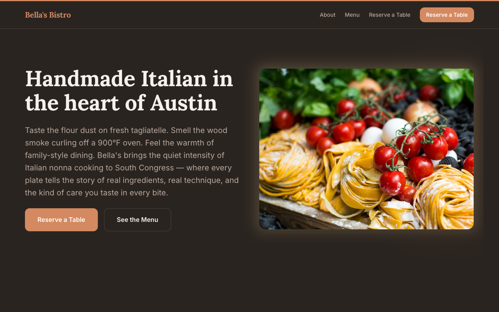

# Bella's Bistro

Handmade Italian in the heart of Austin. Built with [Emdash CMS](https://github.com/emdash-cms/emdash) and deployed to Cloudflare Workers.



**Live site:** [bellas.shipyard.company](https://bellas.shipyard.company)

## About

A restaurant website for Bella's Bistro featuring warm, editorial design with dark navy backgrounds and burnt orange accents. Built autonomously by the Shipyard AI pipeline from a PRD.

## Tech Stack

- **CMS:** Emdash (Astro-based)
- **Database:** Cloudflare D1
- **Storage:** Cloudflare R2
- **Runtime:** Cloudflare Workers
- **Template:** Marketing

## Pages

| Page | Route |
|------|-------|
| Home | `/` |
| About | `/about` |
| Menu | `/menu` |
| Reserve a Table | `/contact` |

## Running Locally

```bash
npm install
npx wrangler dev
```
